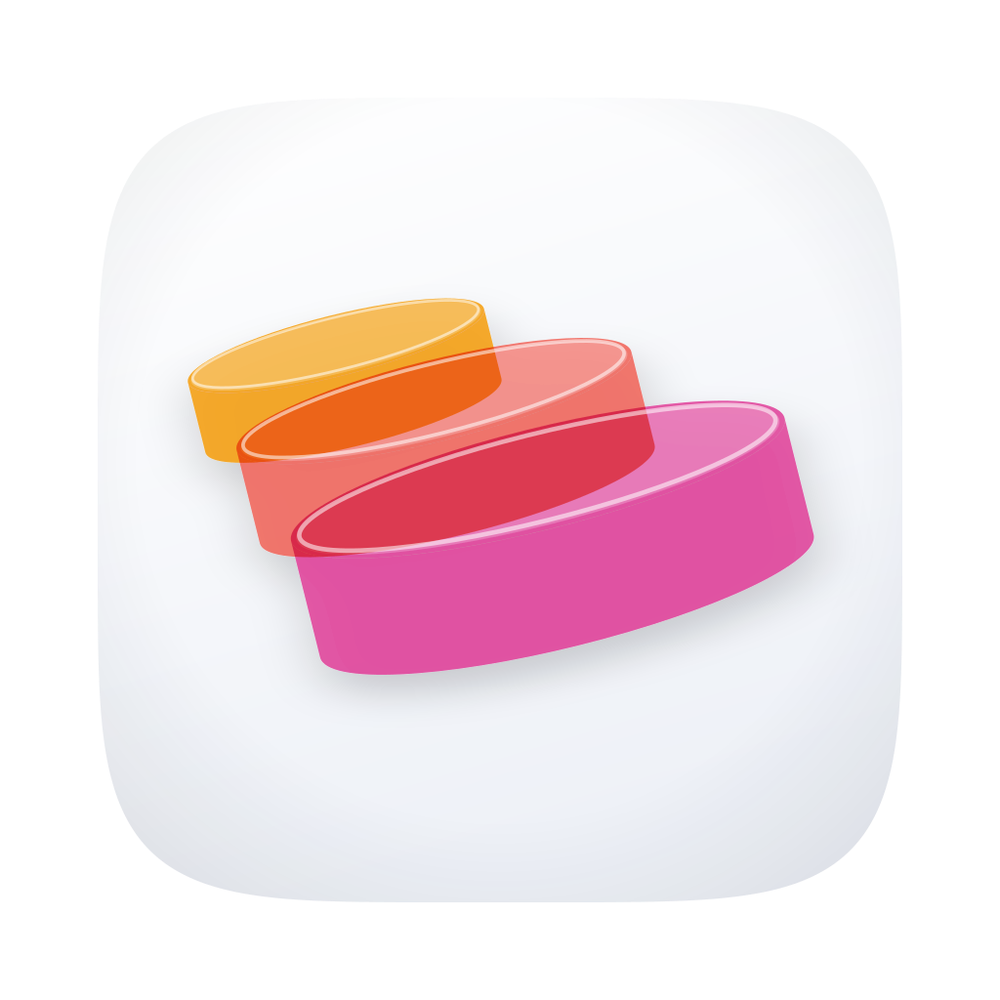

<div align="center">



# Tacivan

**一个快的、开源的 macOS 数据库客户端，给整天泡在 MySQL 里的人**

百万行结果流式加载不卡死，<br>
三千个库的 MySQL 5.7 实例几秒打开，其余时间不打扰你。<br>
Go + 系统 WebView，不是 Electron，不用注册账号，没有埋点。

[](LICENSE)
[](https://github.com/TomEageer/tacivan/releases/latest)
[](https://github.com/TomEageer/tacivan/releases/latest)
[](https://github.com/TomEageer/tacivan/releases)
[](#隐私)
[](#环境要求)

[**⬇ 下载**](https://github.com/TomEageer/tacivan/releases/latest) · [快速开始](#快速开始) · [工作原理](#工作原理) · [插件](docs/plugins.md) · [常见问题](#常见问题) · [**English**](README.md)

</div>

---

## 为什么做 Tacivan

图形化数据库客户端要么是打开个菜单都要四秒的 Java 程序，要么是把一半功能锁在授权后面的收费软件。Tacivan 是我自己桌上想要的那一个：

- 🚀 **慢查询永远堵不住界面** — 结果集经分块缓存流式加载，全局内存预算、超出落盘；一个标签页里卡了 87 秒的读取，不会让另一页两行的表多等一毫秒
- 🐬 **专为又大又老的 MySQL** — 元数据全部走 `SHOW …`，不碰 `information_schema`（5.7 上那是临时表扫描）。3165 个库的实例一个往返列出来；也可以给连接手动指定只显示哪些库
- ⏱ **看得见进度、按得了停止** — 每个耗时操作都显示当前步骤和耗时，停止按钮真的会打断网络读取
- 🔌 **插件连接** — 任何语言、一个进程、stdio 上的 JSON-RPC。插件即一种新的连接类型：自己的表单字段、对象树、右键动作，外加主程序强制的只读门禁。公司内部的那些网关留在你的私有插件里，不在这个仓库
- 🤖 **MCP server 当连接用** — stdio 或 Streamable HTTP；浏览工具和资源，按 JSON Schema 生成表单调用工具，表格结果直接进网格
- 🔎 **全库搜索**某个值出现在哪张表哪个字段，按引擎正确转义
- 🌍 **中文 / 英文** — 界面和 macOS 原生菜单栏跟随同一个设置
- 🔐 **密码进钥匙串**，崩溃后编辑器草稿自动恢复，连接可分组、拖拽排序
- 🆓 **MIT**，单文件，不用登录

|  | Tacivan | DBeaver CE | TablePlus |
|---|---|---|---|
| 价格 | **免费（MIT）** | 免费（Apache-2.0） | 免费档 · 收费 |
| 源码 | **开放** | 开放 | 闭源 |
| 运行时 | **Go + 系统 WebView** | Java / SWT | 原生 |
| 引擎 | MySQL · PostgreSQL · SQLite · Redis · **插件** · **MCP** | 很多（JDBC） | 很多 |
| 自定义连接类型 | **有 — 进程插件，任意语言** | Java 插件 | 无 |
| 连接 MCP server | **有** | 无 | 无 |

比功能数量不是重点：老牌客户端支持的引擎多得多。Tacivan 的定位是打开快、什么都流式、并且能把公司逼你用的那条奇怪的内部网关接进来。

## 快速开始

1. **[下载 DMG](https://github.com/TomEageer/tacivan/releases/latest)**，把 `Tacivan.app` 拖进**应用程序**
2. 第一次启动：**右键 → 打开**（自签名，未经公证）
3. **连接 → 新建**，选引擎，填主机 / 用户 / 密码（密码存 macOS 钥匙串）
4. 双击一张表。完事。

<details>
<summary><b>从源码构建</b></summary>

需要 Go 1.26+、Node 20+、Xcode 命令行工具和 Wails CLI（`go install github.com/wailsapp/wails/v2/cmd/wails@v2.16.0`）。

```bash
git clone https://github.com/TomEageer/tacivan.git && cd tacivan
scripts/vendor.sh          # go mod vendor + patches/ 里的 macOS 菜单补丁
scripts/install.sh         # 通用包 → /Applications/Tacivan.app
scripts/package.sh         # 同上，再打 dist/Tacivan-<版本>.dmg
```

前端热更新用 `wails dev`。

</details>

## 工作原理

```
Vue 3 + CodeMirror 6 (frontend/)          ← WebView；i18n 以中文原文为键
        │  Wails 绑定
internal/app        编排：标签页、进度事件、取消令牌、搜索、草稿
internal/rs         流式结果集：分块缓存 · 磁盘溢出 · 全局内存预算
internal/dbx        引擎无关的模型 + Dialect（引用、SELECT/COUNT/DDL 生成）
internal/driver     mysqldrv · pgdrv · sqlitedrv · redisdrv · plugindrv · mcpdrv
internal/plugin     stdio JSON-RPC 2.0，双向（插件可反向调 host.* 读元数据）
internal/mcp        MCP 客户端，协议 2025-06-18，stdio + Streamable HTTP
internal/store      连接、分组、收藏、草稿、设置；密钥 → 钥匙串
```

- **结果集是游标不是数组。** 标签页只持有一个窗口的分块，其余按进程级预算换出到磁盘，所以十个百万行标签页同时开着也放得下。统计量走原子变量，界面永远不用等抓取锁
- **取消一路到底**：停止按钮取消驱动的 context，打断正在阻塞的 socket 读
- **插件是独立进程。** SQL 到插件之前主程序先执行 `selectOnly` / `singleStatement` / `forceLimit` / `denyPatterns`；只读插件根本没有 Exec 路径。详见 [docs/plugins.md](docs/plugins.md)
- **MCP** 连接就是同一棵树：server → 工具 / 资源 → 双击调用。详见 [docs/mcp.md](docs/mcp.md)
- **Wails** 只打了一个 macOS 补丁（菜单本地化、HIG 规范的「设置…」、标题栏双击），放在 [patches/](patches/README.md)

## 隐私

没有埋点、崩溃上报、更新检查、账号。程序只和你配置的数据库、插件进程、MCP server 通信。密码在 macOS 钥匙串，其余都是 `~/Library/Application Support/Tacivan/` 下的明文 JSON。

## 常见问题

**能当唯一的数据库客户端用吗？**
MySQL / PostgreSQL / SQLite / Redis 的日常：浏览、改数据、设计表、跑 SQL、导出、搜索——能。暂时没有：导入向导、定时备份、ER 图、数据字典、可视化 EXPLAIN。明确不做：存储过程调试器、仪表板、应用内计划任务。

**Windows / Linux？**
Wails 两个都能编，但 Tacivan 目前只在 macOS 上构建和测试过。那个补丁只影响 macOS，其余都是可移植的 Go 和 TypeScript。欢迎 PR。

**为什么不用 Rust / Tauri / Electron？**
Go 给了单个静态二进制、成熟的数据库驱动，以及一个容易做成可取消、内存有界的结果集引擎。WebView 用系统的，所以程序是 22 MB 不是 200。

**插件放哪？**
`~/Library/Application Support/Tacivan/plugins/<id>/`，从**设置 → 插件 → 导入**装入。插件永远不会进发行包，打包脚本会拒绝。

## 环境要求

macOS 13 及以上，Apple Silicon 或 Intel（通用二进制）。

## 支持

免费开源，没有付费版。如果它帮你省了一份授权费，见 [DONATE.md](DONATE.md)。

## 更新日志

见 [CHANGELOG.md](CHANGELOG.md)。

## 许可

[MIT](LICENSE)。引擎标志仅作识别：MySQL 海豚来自 [devicon](https://github.com/devicons/devicon)（MIT），其余来自 [simple-icons](https://github.com/simple-icons/simple-icons)（CC0 1.0）；商标归各自所有者。

<sub>数据库客户端 · MySQL 图形工具 · PostgreSQL · SQLite · Redis · TablePlus 替代 · DBeaver 替代 · MCP 客户端 · macOS · Go · Wails · Vue</sub>
